**Introducción**

Este proyecto analiza un conjunto de datos de **9,718 películas** provenientes de **TMDb** con el objetivo de ofrecer recomendaciones personalizadas. A partir de múltiples atributos —como calificaciones, géneros, actores principales, presupuesto, ingresos y fechas de estreno— se extraen insights que permiten sugerir películas según los gustos y el estado de ánimo del usuario.

El flujo de trabajo completo se desarrolla en el entorno de **Azure Databricks**, donde se lleva a cabo la limpieza, transformación y exploración del dataset. Para organizar y estructurar los datos de manera eficiente, el proyecto implementa la **arquitectura Medallion (Bronze, Silver y Gold)**, lo que permite un proceso ETL escalable, claro y confiable. Esta metodología establece una base sólida para generar recomendaciones más precisas y útiles.

**Dataset utilizado**

El dataset “Which movie should I watch today?” obtenido de kaggle, consta de 4 tablas en formato csv:

- **Movies.csv**
- **FilmDetails.csv**
- **MoreInfo.csv**
- **PosterPath.csv**

**Entorno de desarrollo de Azure y Azure Databricks**

1. **Creación del grupo de recursos:** El nombre del grupo de recursos donde se van a aprovisionar los demás recursos de databricks es **rg-project**.

   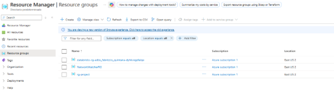

   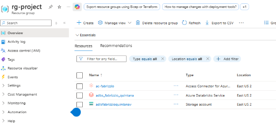

1. **Creación del entorno Azure Databricks:** El recurso **Azure Databricks**, identificado como **adbs\_fabrizzio\_quintana**, constituye el entorno de desarrollo principal del proyecto. Desde este workspace se ejecutan todos los notebooks de procesamiento, transformación y análisis de datos, aprovechando las capacidades de cómputo distribuido y la integración nativa con Azure Data Lake Storage Gen2. Este entorno permite orquestar el flujo de trabajo completo siguiendo la arquitectura medallion, garantizando eficiencia, escalabilidad y control durante cada etapa del pipeline.

   

   Como cómputo, se usa el clúster SD\_Cluster que es uno de tipo single, con el nodo de tipo Standard\_D4s\_v3 (16 GB de memoria con 4 núcleos).

   

   Los notebooks creados están organizados en folders según su fin.

   

   Por ejemplo, la carpeta de ETL contiene los que sirven para ejecutar dicho proceso.

- **Preparación del catálogo, esquema y tablas:** Se ejecuta en **Preparacion\_Ambiente**.
- **Extract (Extracción):** Se ejecuta en:
  - **Ingest film details data**
  - **Ingest more info data**
  - **Ingest movies data**
  - **Ingest posterpath data.**
- **Transform (Transformar):** Se ejecuta en **Transform**.
- **Load (Cargar):** Se ejecuta en **Load**.

1. **Creación del ADLS:** El recurso **ADLS** se denomina **adlsfabrizzioquintanav** y utiliza **Azure Data Lake Storage Gen2** con estructura jerárquica habilitada. Además, la región establecida es **eastus2.** 

   

La organización del almacenamiento sigue el enfoque de la **arquitectura Medallion**, donde cada contenedor corresponde a una capa específica del modelo (bronze, silver y gold).

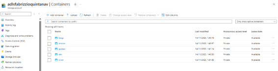

En el contenedor de la capa **raw** se cargan los cuatro archivos originales que sirven como punto de partida para el proceso de ingesta y transformación.

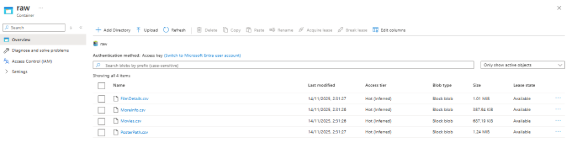

1. **Creación del access connector y asignarlo al ADLS:** El recurso **ac-fabrizzio** corresponde a la identidad administrada **(managed identity)** utilizada para vincular el entorno de Azure Databricks con Azure Data Lake Storage Gen2.\
   Una identidad administrada es una credencial gestionada automáticamente por Microsoft Entra ID, que permite a los recursos de Databricks autenticarse de forma segura en otros servicios de Azure sin necesidad de almacenar o gestionar contraseñas, secretos o certificados. Esto mejora significativamente la seguridad y simplifica la administración del acceso, al proporcionar un mecanismo centralizado, controlado y auditado para la autenticación entre servicios.

   Primero, se crea el access connector.

   

   Luego, se asigna al ADLS con el rol de **Storage Blob Data Contributor**.

   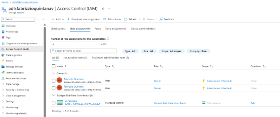

   Finalmente, se crea el storage credential y los external locations por cada uno de los contenedores. El primero se llama **credential**, y los external locations se crearán al ejecutarse el notebook Preparacion\_Ambiente.

   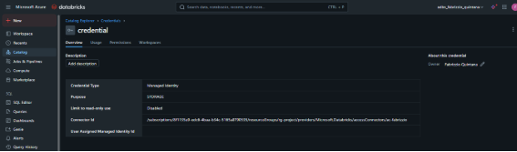

1. **Creación del pipeline automatizado en Azure Data Factory:** Se creó un pipeline denominado **adffabrizzioquinta**, con el objetivo de orquestar todo el proceso ETL. Este pipeline ejecuta de manera secuencial los notebooks alojados en Azure Databricks, controlando cada etapa del flujo mediante actividades organizadas como nodos independientes. Usar esta herramienta brinda una gran ventaja por su mejor capacidad de orquestación, integración directa con otros servicios de Azure y monitoreo centralizado.

   Para ello, primero se crea un linked service llamado **ls\_databricks** lo cuál sirve para conectarnos a databricks. Un linked service almacena la información necesaria para que ADF pueda autenticarse y comunicarse de forma segura con otros servicios, en este caso, permitiendo la ejecución de notebooks directamente desde Databricks.

   

   Luego, se crea el pipeline **pipeline\_ETL** donde se crean los nodos que sirven para realizar el proceso. Además, cada nodo tiene sus variables, vinculadas cada una a los widgets de los notebooks, las cuales sirven para asignar sus valores dentro de esta herramienta.

   

   Se ejecuta y se verifica que lo haya hecho con éxito.

   

   Ahora, para automatizar el proceso, se crea un nuevo ADLS denominado **adlsfabrizzioquinsource** donde se van a guardar los archivos en vez de directamente en el contenedor **raw** del anterior ADLS.

   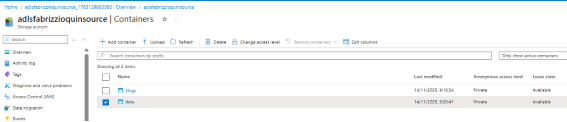

   Se crea el contenedor **data** donde se van a subir los archivos.

   

   Luego, en el entorno de Azure Data Factory, primero se crea el linked service **ls\_adls\_source** que va a servir para vincular el ADLS source a Data Factory.

   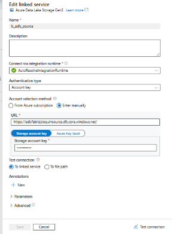

   Luego, se hace lo mismo con el ADLS **adlsfabrizzioquinsource** 

   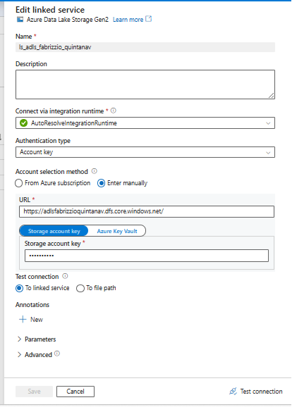

   Ahora se van a usar datasets. Un **dataset en Azure Data Factory** representa una **vista estructurada de los datos**, es decir, una referencia a un archivo, carpeta o tabla específica dentro de un linked service. Define **qué datos** se van a usar y **dónde están ubicados**, permitiendo que las actividades del pipeline los lean o procesen.

   Primero, se crea el dataset source o fuente **ds\_source** la cual apunta al contenedor **data** que contiene todos los archivos a usar.

    

   Luego, se crea el dataset sink o destino **ds\_sink**.

   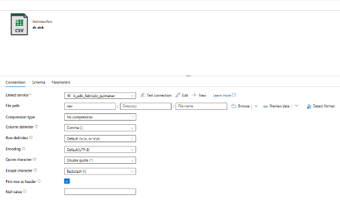

   Ahora, en el pipeline **pipeline\_carga\_datos** se crea el nodo **Copy\_ADLS\_to\_ADLS** donde se usan los datasets ya creados. Este pipeline copia los archivos contenidos en **data** de **adlsfabrizzioquinsource** a **raw** de **adlsfabrizzioquintanav.**

   

   Por último, se crean triggers (o gatilladores) que va a permitir ejecutar de manera automática el pipeline. El primer trigger que se crea es **tg\_events** en el pipeline **pipeline\_ETL** que es de tipo storage events, y que apunta al ADLS **adlsfabrizzioquintanav** en el contenedor **raw**. Este trigger se ejecuta cuando se crean nuevos archivos dentro del contenedor (o Blob) así como cuando se borran.

   

   Ahora se procede a probar la ejecución del trigger, para ello se ejecuta primero el pipeline **pipeline\_carga\_datos** de manera manual.

   

   Luego notamos que el trigger **tg\_events** ejecutó con éxito el pipeline **pipeline\_etl**.

   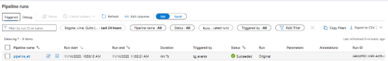

1. **Creación del catálogo, esquemas, y tablas:** En el entorno de Azure Databricks, una vez ejecutado el pipeline, se crea el catálogo **catalog\_dev**, dentro del cual se estructuran tres esquemas siguiendo la arquitectura **Medallion**:
   1. **Bronze:** Contiene las cuatro tablas cargadas directamente desde la capa *raw* del ADLS, sin transformaciones. Esta capa garantiza el almacenamiento fiel y seguro de los datos originales.
   1. **Silver:** En esta capa se aplican procesos de limpieza, estandarización y enriquecimiento de los datos provenientes de Bronze. Además, se realiza un análisis exploratorio que permite comprender mejor la calidad y consistencia de la información.\
      A partir de este procesamiento se generan tres tablas refinadas:
      1. **actors\_top\_extended**
      1. **genres\_extended**
      1. **movies**
   1. **Golden:** Es la capa final del modelo, donde se consolidan los datos ya transformados y listos para su consumo en herramientas de análisis o plataformas de BI.\
      Aquí se generan tres tablas finales que sirven como base para dashboards y análisis avanzados:
      1. **golden\_actors**
      1. **golden\_genres**
      1. **golden\_movies**

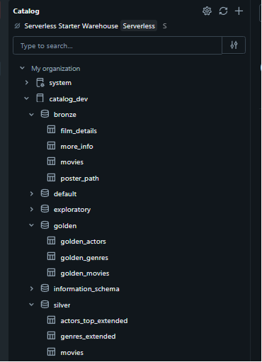

1. **Asignación de permisos:** Se agregan un par de cuentas.

   

   Para un mejor manejo, se crea un grupo denominado **cuentas\_agrupadas** donde se agregan a dichas cuentas.

   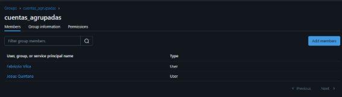

   Luego, se agregan a dichas cuentas en el worksplace.

   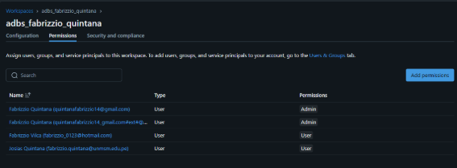

   Por último, se ejecuta el notebook **seguridad\_script** donde se brindan los permisos necesarios a dicho grupo.

   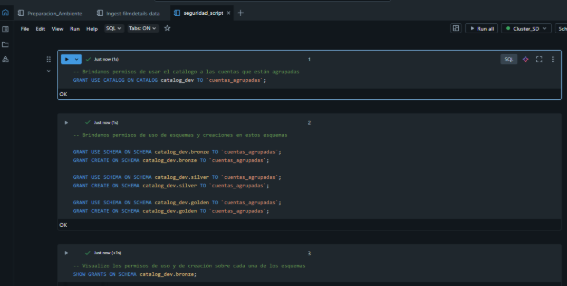

   Se pueden revocar algunos permisos, estos están descritos en el notebook **revoke\_script**.

   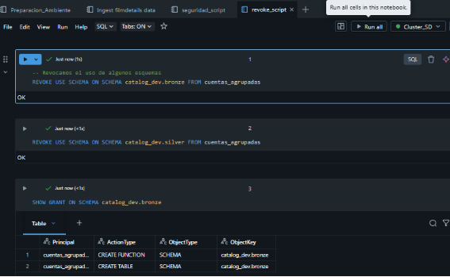

1. **Creación de metastore:** Se crea un nuevo **metastore** que apunta al ADLS **adlsfabrizzioquintanav**, específicamente al contenedor **metastore**. El metastore es el repositorio central donde Unity Catalog almacena toda la información relacionada con catálogos, esquemas, tablas, permisos y configuraciones de gobernanza. Al configurarlo en ADLS, se garantiza que la metadata sea persistente, segura y compartida entre diferentes workspaces.\
   Además, cualquier nuevo workspace de Azure Databricks creado en la región **East US 2** se asignará automáticamente a este metastore, unificando la administración y el control de datos en un único punto.

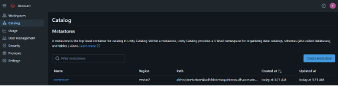

**Entorno de producción de Azure y Azure Databricks**

1. **Creación del entorno de producción:** El servicio de Azure Databricks de producción, denominado **adbs\_fabrizzio\_prod**, se aprovisiona para poder replicar lo que se había hecho anteriormente en dicho ambiente.
1. **Despliegue en producción:** Cada vez que se realiza un pull con los cambios aplicados al archivo YAML, GitHub Actions ejecuta automáticamente el flujo definido. El pipeline corre sin errores y finaliza correctamente, indicando que la configuración y los pasos del workflow se procesaron de forma exitosa.

   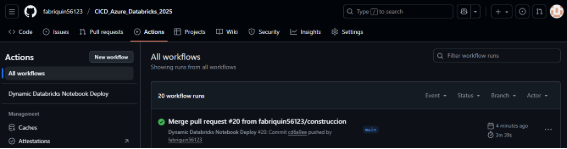

1. **Verificación de los elementos de desarrollo en producción:**

   Se verifica que los notebooks se han subido en el entorno de producción

   

   Además, dichos notebooks se ejecutaron de manera exitosa. Esto se demuestra al verificar que se crearon los esquemas y tablas en el ambiente de producción.

   